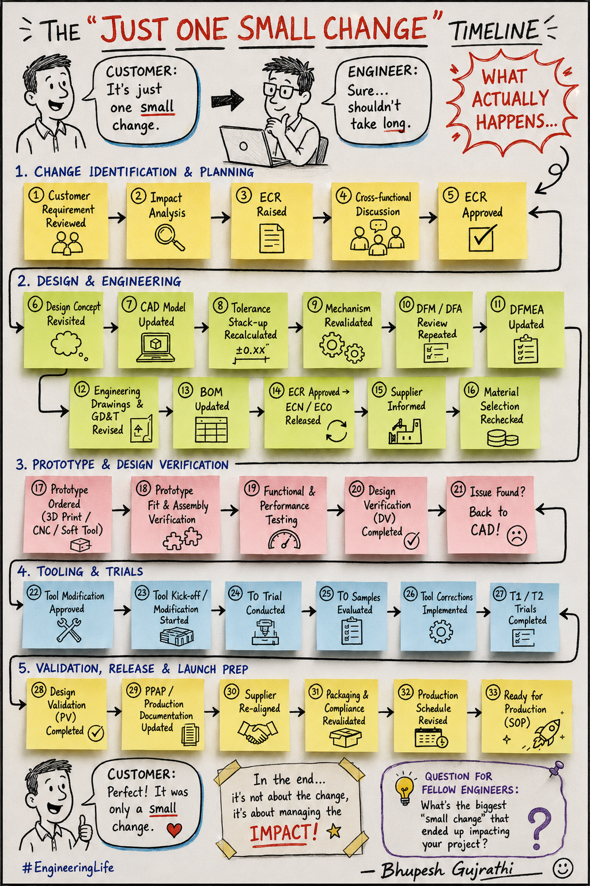

# Engineering Change Notice (ECN) / Engineering Change Order (ECO) Checklist

> A practical checklist for managing engineering changes from customer request through production release.

---

## Purpose

Engineering changes often appear to be "just one small change," but even a minor design modification can impact product performance, tooling, cost, quality, suppliers, documentation, and production schedules.

This checklist helps ensure that every Engineering Change Notice (ECN) follows a structured review process before implementation.

---

### 📌 ECN Workflow

---

### Phase 1 – Change Identification & Planning

| ✓ | Activity | Objective |
|---|----------|-----------|
| ☐ | Review customer or internal requirement | Understand the requested change |
| ☐ | Perform impact analysis | Identify technical, manufacturing, cost and schedule impacts |
| ☐ | Raise ECN/ECR | Document the proposed engineering change |
| ☐ | Conduct cross-functional review | Gather feedback from Design, Manufacturing, Quality, Purchasing and Supply Chain |
| ☐ | Obtain management approval | Authorize implementation |

---

### Phase 2 – Design & Engineering

| ✓ | Activity |
|---|----------|
| ☐ | Update design concept |
| ☐ | Modify CAD models |
| ☐ | Recalculate tolerance stack-up |
| ☐ | Revalidate mechanisms |
| ☐ | Repeat DFM/DFA review |
| ☐ | Update DFMEA |
| ☐ | Revise engineering drawings |
| ☐ | Update GD&T if required |
| ☐ | Update Bill of Materials (BOM) |
| ☐ | Release ECN / ECO / ECN package |
| ☐ | Inform suppliers |
| ☐ | Reconfirm material selection |

---

### Phase 3 – Prototype & Verification

| ✓ | Activity |
|---|----------|
| ☐ | Manufacture prototype |
| ☐ | Verify fit and assembly |
| ☐ | Perform functional testing |
| ☐ | Complete Design Verification (DV) |
| ☐ | Record observations |
| ☐ | If issues are found, update CAD and repeat verification |

---

### Phase 4 – Tooling & Manufacturing

| ✓ | Activity |
|---|----------|
| ☐ | Approve tooling modification |
| ☐ | Start tool modification |
| ☐ | Conduct tool trials |
| ☐ | Evaluate trial samples |
| ☐ | Implement tool corrections |
| ☐ | Complete T1/T2 validation |

---

### Phase 5 – Release & Production

| ✓ | Activity |
|---|----------|
| ☐ | Complete Product Validation (PV) |
| ☐ | Update PPAP documentation |
| ☐ | Align with suppliers |
| ☐ | Validate packaging and compliance |
| ☐ | Update production schedule |
| ☐ | Approve for SOP (Start of Production) |

---

### Key Documents

- Engineering Change Request (ECR)
- Engineering Change Notice (ECN)
- Engineering Change Order (ECO)
- CAD Models
- Engineering Drawings
- GD&T Drawings
- BOM
- DFMEA
- DFM/DFA Report
- Test Reports
- PPAP Documents

---

### Cross-Functional Teams Involved

- Product Design
- Project Engineering
- Manufacturing Engineering
- Tooling
- Quality
- Supply Chain
- Purchasing
- Regulatory
- Testing Laboratory
- Suppliers

---

### Common Risks

- Poor impact analysis
- Outdated BOM
- Uncontrolled drawing revisions
- Missing supplier communication
- Tool modification delays
- Incorrect material selection
- Validation skipped
- Production using obsolete revision

---

### Best Practices

- Never approve an ECN without impact analysis.
- Review the complete product, not only the modified feature.
- Validate design changes before tooling modifications.
- Maintain revision control for CAD, drawings, and BOM.
- Ensure suppliers receive the latest released documentation.
- Close every ECN only after production validation.

### Author

**Bhupesh Gujrathi**

Senior Mechanical Design Engineer

Passionate about Product Development, Plastic Design, DFM, VAVE, and Engineering Best Practices.

> If you found this checklist helpful, consider ⭐ starring this repository.
