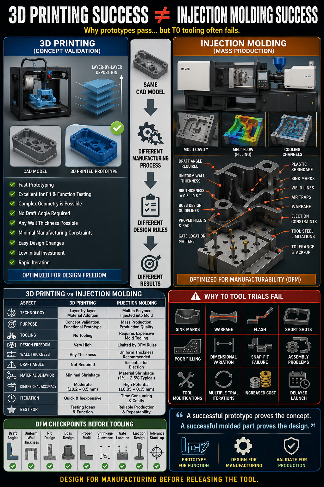

# 🏭 3D Printing Success ≠ Injection Molding Success

> **A successful 3D-printed prototype validates your concept.**  
> **A successful injection-molded part validates your design for manufacturing.**

Many new product developments fail during tooling because the design was optimized for **3D printing**, not **Injection Molding**.

This guide explains why a prototype that performs perfectly can still fail during mold trials—and how to avoid expensive tooling modifications.

---



# 🎯 Why This Matters

A common misconception is:

> **"The prototype worked, so production will work too."**

Unfortunately, that's often not true.

Although both parts are created from the **same CAD model**, they are manufactured using **completely different processes**, each with unique design constraints.

Designing only for prototype success often leads to:

- ❌ Tool modifications
- ❌ Multiple mold trials
- ❌ Production delays
- ❌ Increased tooling cost
- ❌ Product launch delays

---

# 🖨️ 3D Printing vs 🏭 Injection Molding

| Aspect | 3D Printing | Injection Molding |
|---------|-------------|-------------------|
| Primary Purpose | Concept Validation | Mass Production |
| Manufacturing Process | Layer-by-layer material addition | Molten plastic injected into a mold |
| Tooling Required | No | Yes (Injection Mold) |
| Design Freedom | Very High | Governed by DFM principles |
| Draft Angle | Not Required | Required |
| Wall Thickness | Flexible | Uniform wall thickness recommended |
| Material Behavior | Minimal shrinkage | Shrinkage, warpage & residual stress |
| Design Changes | Fast & inexpensive | Costly after tooling |
| Best Used For | Design validation | Production validation |

---

# 💡 Why the Same CAD Model Behaves Differently

Although the CAD geometry remains unchanged, the manufacturing process changes everything.

### 3D Printing

Designed for:

- Rapid iteration
- Functional prototypes
- Fit checks
- Ergonomic validation
- Concept evaluation

Design constraints are minimal.

---

### Injection Molding

Designed for:

- High-volume manufacturing
- Repeatability
- Process capability
- Cycle time optimization
- Moldability

Manufacturing constraints become critical.

---

# 📌 Injection Molding Design Rules

Before releasing a design for tooling, review the following:

### ✅ Draft Angles

Provide adequate draft to allow easy part ejection.

---

### ✅ Uniform Wall Thickness

Avoid sudden wall thickness changes.

Benefits include:

- Better filling
- Lower shrinkage variation
- Reduced sink marks
- Lower warpage

---

### ✅ Rib Design

Use ribs for stiffness instead of increasing wall thickness.

Typical recommendation:

- Rib thickness ≈ **50–60%** of nominal wall thickness

---

### ✅ Boss Design

Bosses should follow established design guidelines to avoid:

- Sink marks
- Cracking
- Poor filling

---

### ✅ Fillets & Radii

Avoid sharp internal corners.

Proper radii improve:

- Material flow
- Strength
- Mold filling
- Tool life

---

### ✅ Gate Location

Gate placement affects:

- Weld lines
- Air traps
- Filling balance
- Cosmetic appearance
- Warpage

Gate selection should never be an afterthought.

---

### ✅ Shrinkage Allowance

Every plastic material shrinks differently.

Always account for:

- Material shrinkage
- Cooling behavior
- Fiber orientation (if reinforced)
- Dimensional stability

---

### ✅ Ejection Design

Ensure the part can be ejected without:

- Marks
- Distortion
- Sticking
- Cracking

---

### ✅ Tolerance Stack-up

A part may be within tolerance and still fail during assembly.

Critical assemblies should always undergo:

- Worst Case Analysis
- RSS Analysis
- Functional tolerance review

---

# ⚠ Common Reasons Tool Trials Fail

Ignoring Design for Manufacturing (DFM) often results in:

- Sink Marks
- Warpage
- Flash
- Short Shots
- Poor Filling
- Weld Lines
- Air Traps
- Snap-fit Failure
- Dimensional Variation
- Assembly Issues
- Cosmetic Defects
- Multiple Tool Modifications

Every tooling change increases:

- 💰 Cost
- ⏳ Lead Time
- 🔁 Trial Iterations

---

# ✅ DFM Checklist Before Tool Release

Before approving mold manufacturing, verify:

- ✔ Draft angles applied
- ✔ Uniform wall thickness maintained
- ✔ Rib thickness optimized
- ✔ Boss design follows guidelines
- ✔ Proper fillets and radii added
- ✔ Material shrinkage considered
- ✔ Gate location reviewed
- ✔ Ejection strategy validated
- ✔ Tolerance stack-up completed
- ✔ Critical dimensions linked to functional requirements

---

# 🚀 Best Development Workflow

```text
Customer Requirement
        │
        ▼
Concept Design
        │
        ▼
3D Printed Prototype
        │
        ▼
Fit • Function • Ergonomics Validation
        │
        ▼
Design for Manufacturing (DFM)
        │
        ▼
Mold Flow Analysis (if applicable)
        │
        ▼
Tolerance Stack-up Review
        │
        ▼
Tool Design
        │
        ▼
Tool Trials
        │
        ▼
Production Release
```

---

# 💡 Key Engineering Takeaways

- A prototype proves the concept—not the manufacturing process.
- Design rules for 3D printing are different from injection molding.
- Tooling should never begin without a comprehensive DFM review.
- Early investment in manufacturability reduces tooling cost, trial iterations, and product launch delays.
- The most expensive design change is the one discovered **after the mold is built**.

---

# 🎯 When Should You Use This Guide?

This reference is valuable for:

- 📦 Plastic Product Design
- 🏭 Injection Molding
- 🚀 New Product Development (NPD)
- 📐 Design for Manufacturing (DFM)
- 🔧 Tooling Engineers
- ⚙️ Mechanical Design Engineers
- 📊 Product Development Teams
- 🎓 Engineering Students learning plastic part design

---

> **"Prototype for function. Design for manufacturing. Validate for production."**

---

<div align="center">

### 👨‍💻 Created by **Bhupesh Gujrathi**

**Senior Mechanical Design Engineer**

*DFMEA • DFM • DFA • GD&T • Tolerance Stack-up • Plastic Product Design • Value Engineering • NPD*

⭐ **If you found this guide valuable, consider giving the repository a Star!**

*"A successful prototype proves the concept. A successful molded part proves the design."*

</div>
