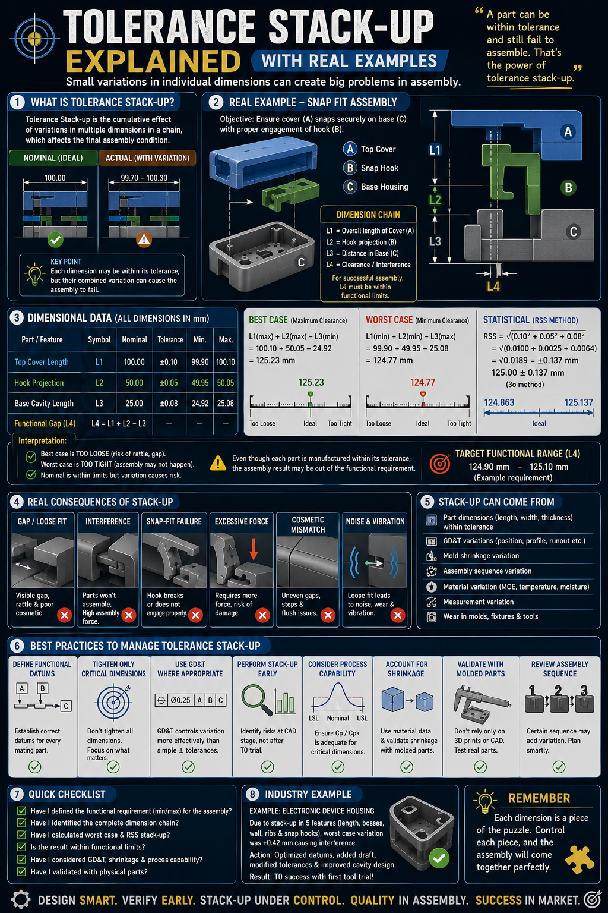

# 📐 Tolerance Stack-up Explained

> **Every individual part can be within its specified tolerance and yet the final assembly may still fail.**  
> That's the essence of **Tolerance Stack-up Analysis**—understanding how dimensional variations accumulate across multiple components.

This guide introduces the fundamentals of tolerance stack-up, why it matters in product development, and best practices to design robust, manufacturable assemblies.

---

# 🎯 Why Tolerance Stack-up Matters

Tolerance stack-up is the cumulative effect of dimensional variations in an assembly.

Although each component may satisfy its individual drawing tolerance, the **combined variation** can lead to:

- ❌ Assembly interference
- ❌ Excessive clearance
- ❌ Snap-fit failure
- ❌ Cosmetic gaps
- ❌ High assembly force
- ❌ Noise & vibration
- ❌ Reduced product reliability

> **Engineering is not about controlling one dimension—it's about controlling the entire dimension chain.**

---

# 📖 What is Tolerance Stack-up?

Tolerance Stack-up is the analysis of how dimensional variations accumulate through a chain of features that determine a functional requirement.

A typical stack-up answers questions like:

- Will these parts assemble?
- What is the minimum and maximum functional gap?
- Will the snap-fit engage correctly?
- Will bearings preload correctly?
- Will cosmetic gaps remain acceptable?

---

# 🧩 Where Does Stack-up Come From?

Dimensional variation is influenced by many sources—not just machining accuracy.

### Common contributors include:

- 📏 Part dimensions (length, width, thickness)
- 📐 GD&T variations
- 🏭 Manufacturing process capability
- 🧊 Plastic shrinkage & warpage
- 🌡 Thermal expansion
- 💧 Moisture absorption
- 🔩 Assembly sequence
- 📦 Material variation
- 📊 Measurement uncertainty
- 🔧 Tool wear & fixture variation

---

# 📊 Common Stack-up Analysis Methods

## 1️⃣ Worst Case Analysis

Assumes every dimension reaches its maximum tolerance simultaneously.

### Best for:

- Safety-critical products
- Aerospace
- Medical devices
- High-risk assemblies

**Advantages**

- Guaranteed assembly
- Conservative approach

**Limitations**

- Often results in tighter tolerances
- Higher manufacturing cost

---

## 2️⃣ Root Sum Square (RSS)

Statistical method assuming dimensional variations are independent and normally distributed.

### Best for:

- High-volume manufacturing
- Consumer products
- Automotive
- Electronics

**Advantages**

- More realistic
- Lower manufacturing cost
- Better tolerance optimization

---

## 3️⃣ Monte Carlo Simulation

Uses random sampling to predict assembly variation.

### Best for:

- Complex assemblies
- Multi-variable systems
- High-confidence design validation

---

# ⚠ Common Consequences of Poor Stack-up

Ignoring tolerance stack-up may result in:

- Loose fits
- Interference fits
- Snap-fit failure
- Excessive insertion force
- Cosmetic mismatch
- Functional failure
- Noise & vibration
- Increased warranty claims
- High rework and scrap costs

---

# ✅ Best Practices

### Define Functional Requirements

Before assigning tolerances, define:

- Required clearance
- Interference limits
- Alignment requirements
- Functional gap

---

### Establish Functional Datums

Select datums based on assembly function—not manufacturing convenience.

---

### Tighten Only Critical Dimensions

Not every dimension requires a tight tolerance.

Focus on dimensions that directly affect functionality.

---

### Use GD&T Effectively

GD&T often controls functional variation more efficiently than tightening linear dimensions.

Examples include:

- Position
- Profile
- Flatness
- Perpendicularity
- Runout

---

### Perform Stack-up Early

Don't wait until prototype builds.

Perform tolerance stack-up during:

- CAD design
- Design reviews
- DFM studies
- Design validation

Early analysis prevents costly design iterations.

---

### Consider Process Capability

A tolerance is only meaningful if the manufacturing process can consistently achieve it.

Evaluate:

- Cp
- Cpk
- Process variation
- Supplier capability

---

### Validate with Physical Parts

Simulation is valuable—but prototypes confirm reality.

Always validate:

- Critical fits
- Functional gaps
- Assembly force
- Cosmetic appearance

---

# 📝 Quick Design Review Checklist

Before releasing a design, ask yourself:

- ✅ Have I identified the complete dimension chain?
- ✅ Is the functional requirement clearly defined?
- ✅ Have I performed Worst Case or RSS analysis?
- ✅ Are critical dimensions linked to functional datums?
- ✅ Have I considered GD&T where appropriate?
- ✅ Does the manufacturing process support the specified tolerances?
- ✅ Have plastic shrinkage, thermal effects, and assembly sequence been considered?
- ✅ Has the design been validated with prototype parts?

---

# 💡 Key Engineering Takeaways

- Every tolerance contributes to the final assembly.
- Tight tolerances increase manufacturing cost.
- Functional dimensions deserve the highest attention.
- Stack-up analysis should be performed before tooling—not after failures occur.
- Good tolerance allocation balances **function, manufacturability, quality, and cost.**

---

# 🎯 When Should You Perform Stack-up Analysis?

Tolerance stack-up is recommended for:

- 📦 Plastic Part Design
- ⚙️ Precision Assemblies
- 🔩 Fastener Design
- 🧩 Snap-fit Assemblies
- 🚗 Automotive Components
- ✈ Aerospace Products
- 🏥 Medical Devices
- 📱 Consumer Electronics
- 🏭 Injection Molded Products
- 🚀 New Product Development (NPD)

---

> **"A part may be within tolerance and still fail to assemble. The assembly only succeeds when the entire dimension chain is under control."**

---

### 👨‍💻 Created by **Bhupesh Gujrathi**

**Mechanical Design Engineering Professional**

*DFMEA • DFM • DFA • GD&T • Tolerance Stack-up • Plastic Product Design • Value Engineering • NPD*

⭐ **If you found this guide valuable, consider giving the repository a Star!**

*"Design smart. Verify early. Control variation before it becomes failure."*

