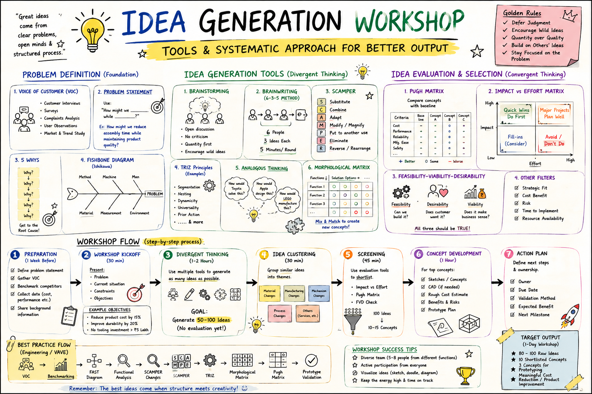

# 💡 Idea Generation Workshop for Mechanical Design Engineers

> **Great ideas rarely happen by accident.**  
> Creativity is valuable, but without a structured approach, teams often end up with random ideas, endless discussions, and no clear outcome.

> This guide provides a **systematic framework** to conduct an **Engineering Idea Generation Workshop**—from defining the problem to selecting the best concept for development.

> **If you have the creativity but don't know where or how to start, this guide is for you.**

---
  

# 🎯 Workshop Objective

Generate innovative, practical, and manufacturable engineering solutions using proven creativity tools and structured evaluation methods.

Typical applications include:

- 💰 Cost Reduction (Value Engineering)
- 🏭 Design for Manufacturing (DFM)
- 🔧 Design for Assembly (DFA)
- 🚀 New Product Development (NPD)
- 📦 Packaging Optimization
- ⚙️ Process Improvement
- ♻️ Product Redesign
- 📈 Continuous Improvement

---

# 🏁 Step 1 — Define the Problem

A successful workshop starts with a well-defined problem.

### Collect the Voice of Customer (VOC)

- Customer feedback
- Warranty issues
- Service reports
- User observations
- Market research

### Create a Problem Statement

Instead of saying:

> "Reduce cost"

Write:

> **"How might we reduce product cost while maintaining reliability and functionality?"**

---

# 🔍 Step 2 — Find the Root Cause

Before generating solutions, understand the actual problem.

Use tools such as:

- ✅ 5 Why Analysis
- ✅ Fishbone Diagram (Ishikawa)
- ✅ Functional Analysis

---

# 💡 Step 3 — Generate Ideas (Divergent Thinking)

During this phase:

✔ Quantity over quality

✔ No criticism

✔ Encourage wild ideas

✔ Build on others' ideas

### Recommended Creativity Tools

| Tool | Purpose |
|-------|----------|
| Brainstorming | Group discussion |
| Brainwriting (6-3-5) | Silent idea generation |
| SCAMPER | Challenge existing designs |
| TRIZ | Solve engineering contradictions |
| Analogous Thinking | Learn from other industries |
| Morphological Matrix | Create new concept combinations |

🎯 **Target:** Generate **50–100 ideas** without evaluating them.

---

# 📂 Step 4 — Cluster Similar Ideas

Group ideas into themes.

Example:

- Material Changes
- Manufacturing Changes
- Mechanism Improvements
- Assembly Improvements
- Cost Reduction
- Service Improvements

This makes evaluation much easier.

---

# 📊 Step 5 — Evaluate & Select Concepts

Not every idea deserves development.

Use structured evaluation tools:

### Pugh Matrix

Compare concepts against a baseline.

### Impact vs Effort Matrix

| High Impact | Low Effort |
|--------------|------------|
| Quick Wins ✅ |

### Feasibility – Viability – Desirability

Ask:

- Can we build it?
- Does the customer want it?
- Does it make business sense?

---

# 🛠 Step 6 — Develop the Best Concepts

For shortlisted ideas:

- Create sketches
- Develop CAD concepts
- Estimate cost
- Perform DFM/DFA review
- Identify risks
- Build prototypes (if required)

---

# 🚀 Step 7 — Create an Action Plan

Every workshop should end with:

- Owner
- Due Date
- Validation Method
- Expected Benefit
- Next Milestone

Ideas without execution create no value.

---

# 🏆 Golden Rules of Idea Generation

✅ Defer judgement

✅ Encourage wild ideas

✅ Quantity before quality

✅ Build on others' ideas

✅ Stay focused on the problem

---

# 📈 Expected Workshop Output

A well-executed one-day workshop typically delivers:

- 💡 80–100 Raw Ideas
- 📋 10–15 Shortlisted Concepts
- 🏆 3–5 High-Potential Solutions
- 📉 Measurable Cost Reduction Opportunities
- 🚀 Product or Process Improvement Roadmap

---

# 💬 Final Thought

> **Innovation isn't about waiting for inspiration. It's about following a repeatable process that turns creativity into engineering solutions.**

Whether you're solving a manufacturing issue, reducing product cost, or designing the next generation of products, a structured workshop dramatically improves the quality of ideas and decision-making.

---

## 👨‍💻 Created by **Bhupesh Gujrathi**

**Mechanical Design Engineering Professional**

*DFMEA • DFM • DFA • GD&T • Tolerance Stack-up • Plastic Product Design • Value Engineering • NPD*

⭐ **If you found this guide useful, consider giving the repository a Star!**

*"Engineering innovation begins with asking better questions and following a better process."*

