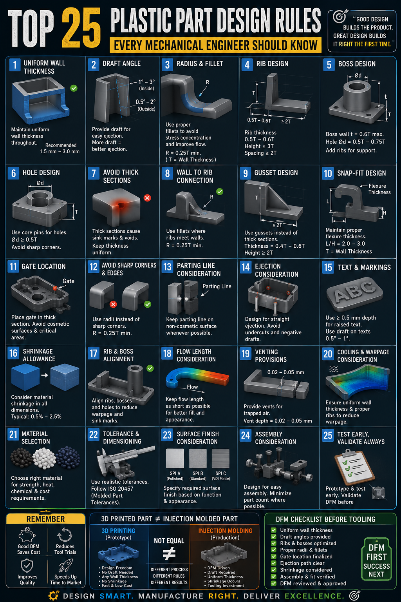

# Mechanical-Design-Toolkit

## 🏭 Design for Manufacturing & Assembly (DFM&A) Checklist

> **Purpose:**  
> This checklist helps engineers evaluate whether a design is ready for manufacturing by considering manufacturability, quality, cost, assembly, and production risks.

---
### 📌 Visual Guide

### 📌 General Design

| ✔ | Checkpoint |
|---|------------|
| ☐ | Product requirements are clearly defined. |
| ☐ | Design meets functional requirements. |
| ☐ | Part geometry is as simple as possible. |
| ☐ | Number of components is minimized. |
| ☐ | Standard components are used wherever possible. |
| ☐ | Design avoids unnecessary complexity. |
| ☐ | Cost targets have been considered. |

---

### 📐 Part Geometry

| ✔ | Checkpoint |
|---|------------|
| ☐ | Uniform wall thickness maintained. |
| ☐ | Sharp corners replaced with radii. |
| ☐ | Stress concentration minimized. |
| ☐ | Proper draft provided. |
| ☐ | Ribs follow recommended thickness ratio. |
| ☐ | Bosses designed as per guidelines. |
| ☐ | Undercuts minimized. |
| ☐ | Deep ribs or thin walls avoided where possible. |

---

### 🏭 Injection Molding

| ✔ | Checkpoint |
|---|------------|
| ☐ | Mold opening direction defined. |
| ☐ | Parting line optimized. |
| ☐ | Gate location reviewed. |
| ☐ | Ejection method considered. |
| ☐ | Sink marks evaluated. |
| ☐ | Weld line locations acceptable. |
| ☐ | Air traps minimized. |
| ☐ | Warpage risk assessed. |
| ☐ | Mold flow analysis completed (if required). |

---

### 🔩 Assembly (DFA)

| ✔ | Checkpoint |
|---|------------|
| ☐ | Assembly direction simplified. |
| ☐ | Self-locating features provided. |
| ☐ | Error-proofing (Poka-Yoke) incorporated. |
| ☐ | Fastener count minimized. |
| ☐ | Tool accessibility ensured. |
| ☐ | Serviceability considered. |

---

# 📏 Tolerances & GD&T

| ✔ | Checkpoint |
|---|------------|
| ☐ | Critical dimensions identified. |
| ☐ | GD&T applied where required. |
| ☐ | Tolerance stack-up completed. |
| ☐ | Datums properly defined. |
| ☐ | Manufacturing capability considered while assigning tolerances. |

---

### 📄 Engineering Documentation

| ✔ | Checkpoint |
|---|------------|
| ☐ | CAD model updated. |
| ☐ | Engineering drawings released. |
| ☐ | BOM verified. |
| ☐ | Material specifications updated. |
| ☐ | Surface finish specified. |
| ☐ | Revision history updated. |

---

### ⚙ Manufacturing Process

| ✔ | Checkpoint |
|---|------------|
| ☐ | Manufacturing process selected. |
| ☐ | Special tooling identified. |
| ☐ | Machine limitations considered. |
| ☐ | Inspection features accessible. |
| ☐ | Cycle time optimized. |

---

### 🧪 Validation

| ✔ | Checkpoint |
|---|------------|
| ☐ | Prototype available. |
| ☐ | Fit & assembly verified. |
| ☐ | Functional testing completed. |
| ☐ | Reliability testing completed. |
| ☐ | Design Verification (DV) completed. |
| ☐ | Design Validation (PV) completed (if applicable). |

---

### 🔄 Change Management

| ✔ | Checkpoint |
|---|------------|
| ☐ | Design review completed. |
| ☐ | DFMEA updated. |
| ☐ | Risks reviewed. |
| ☐ | ECR/ECO/ECN completed (if applicable). |
| ☐ | Supplier informed. |
| ☐ | Tool modification approved (if applicable). |

---

# 💰 Cost Optimization

| ✔ | Checkpoint |
|---|------------|
| ☐ | Part count minimized. |
| ☐ | Material optimized. |
| ☐ | Standard hardware used. |
| ☐ | Manufacturing cost reviewed. |
| ☐ | Assembly cost reviewed. |
| ☐ | VAVE opportunities evaluated. |

---

### 📋 Final Design Review

| ✔ | Checkpoint |
|---|------------|
| ☐ | Product meets customer requirements. |
| ☐ | Design is manufacturable. |
| ☐ | Design is assembly-friendly. |
| ☐ | Quality risks addressed. |
| ☐ | Documentation complete. |
| ☐ | Design approved for production. |

---

### 💡 Pro Tip

A successful DFM review is not just about identifying problems—it's about balancing functionality, manufacturability, quality, cost, reliability, and production efficiency.

---

#### 👨‍💼 Author

**Bhupesh Gujrathi**

Mechanical Design Engineering Professional

*Continuous Improvement | Product Development | Design for Manufacturing*
